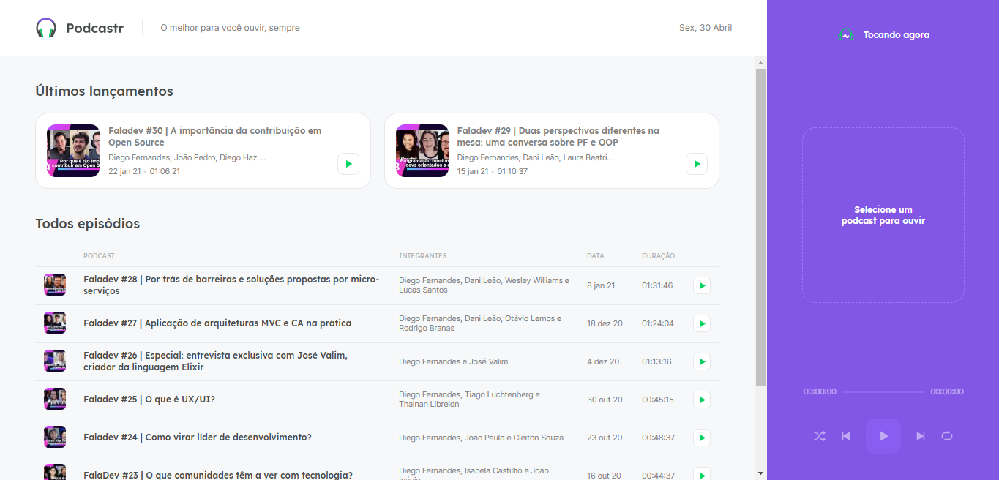

# Podcastr

> Uma plataforma de podcasts desenvolvida com o Next.js.

## Sumário

- [Informações Adicionais](#Informações-Adicionais)
- [Screenshots](#Screenshots)
- [Tecnologias](#Tecnologias)
- [Setup](#setup)
- [Funcionalidades](#Funcionalidades)

## Informações Adicionais

Este Projeto foi desenvolvido durante a NLW#5 no intuito de ser uma introdução ao Next.js e também se aprimorar no uso de React e de programação em geral.

## Screenshots

## Tecnologias

- React
- Next.js

## Setup

Para rodar a aplicação primeiro execute o comando:
` npm run dev # ou yarn dev`

E para rodar a "falsa" API use o comando:
`yarn server`

## Funcionalidades

Dentre as principais funcionalidades que foram adicionadas a aplicação o uso dessas se destacam:

- Uso de Server-side-redering
- Uso de Static Site Generation por parte do Next.js
